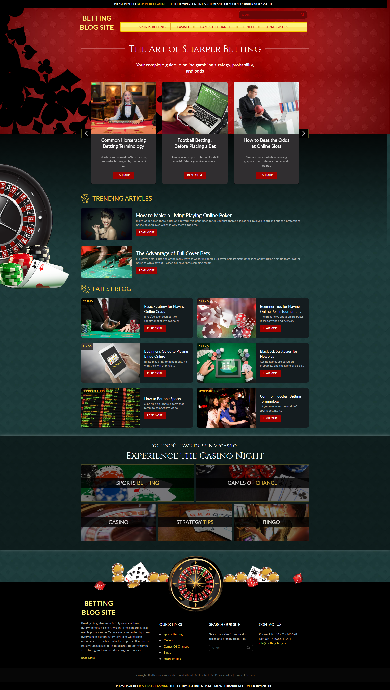

# betting-blog-site
betting-blog-site

MENUS
- Appreance -> Menus -> create new menu 'Category menu' -> in 'menu settings' in 'display location' -> check the checkbox which says 'Category Menu'- > click on 'create menu' - then under 'categories' tab form left sidebar, select all the categories whihc you wnat to see in your menu - click 'Add to menu' - 'Save menu' - works for maximum 5 categories

PAGES
- add new page -> title will be 'Home' -> on the right sidebar, under 'Page' tab , under template section, select 'Home Page' -> publis
- same for about us, privacy policy, terms of service

SET HOME PAGE AS FRONT PAGE
- we weill set the above hoem page as our front page, left sidebar 'Settings' -> 'reading' -> 'Your homepage displays' -> select radio btn: a staic page, in homepage option: you can see dropdown , sleect home(the title of the page woy created in above step) -> save changes

plugins
- sidebar plugings -> add new -> search 'Simple Image Sizes' - install now -> activate -> settings- at the bottom there will be a btn 'Regenearte Thumbnails' -> then save chnages

<!-- 

 -->

